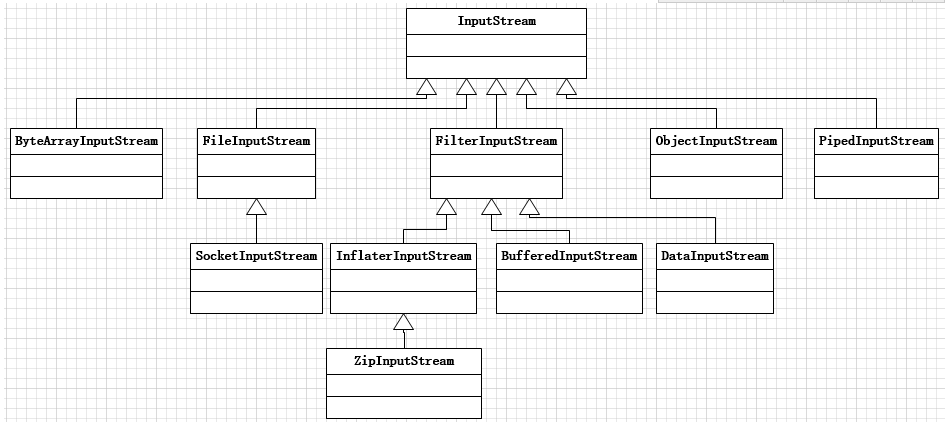

# 装饰器模式（Decorator Pattern）

<!-- TOC -->

- [装饰器模式（Decorator Pattern）](#装饰器模式decorator-pattern)
    - [例子](#例子)
    - [字节输入流InputStream](#字节输入流inputstream)
    - [字符输入流Reader](#字符输入流reader)
    - [半透明装饰器模式与全透明装饰器模式](#半透明装饰器模式与全透明装饰器模式)
    - [装饰器模式的优缺点](#装饰器模式的优缺点)
    - [装饰器模式和适配器模式的区别](#装饰器模式和适配器模式的区别)

<!-- /TOC -->

通常给对象添加功能，要么直接修改对象添加相应的功能，要么派生子类来扩展，抑或是使用对象组合的方式。显然，直接修改对应的类的方式并不可取，在面向对象的设计中，我们应该尽量使用组合对象而不是继承对象来扩展和复用功能，装饰器模式就是基于对象组合的方式的。

装饰器模式以对客户端透明的方式动态地给一个对象附加上了更多的责任。换言之，客户端并不会角色对象在装饰前和装饰后有什么不同。装饰器模式可以在不用创建更多子类的情况下，将对象的功能加以扩展。


Decorator装饰器，顾名思义，就是动态地给一个对象添加一些额外的职责，就好比为房子进行装修一样。因此，装饰器模式具有如下的特征：

1. 它必须具有一个装饰的对象。
1. 它必须拥有与被装饰对象相同的接口。
1. 它可以给被装饰对象添加额外的功能。

用一句话总结就是：保持接口，增强性能。

装饰器通过包装一个装饰对象来扩展其功能，而又不改变其接口，这实际上是基于对象的适配器模式的一种变种。它与对象的适配器模式的异同点如下。
- 相同点：都拥有一个目标对象。
- 不同点：适配器模式需要实现另外一个接口，而装饰器模式必须实现该对象的接口。

## 例子

现在有这么一个场景：

1. 有一批厨师，简单点吧，就全是中国厨师，他们有一个共同的动作是做晚饭
1. 这批厨师做晚饭前的习惯不同，有些人喜欢做晚饭前洗手、有些人喜欢做晚饭前洗头

``` java
public interface Cook {
    public void cookDinner();
}
```

``` java
public class ChineseCook implements Cook {

    @Override
    public void cookDinner() {
        System.out.println("中国人做晚饭");
    }
    
}
```


``` java
public abstract class FilterCook implements Cook {
    protected Cook cook;
}
```

``` java
public class WashHandsCook extends FilterCook {

    public WashHandsCook(Cook cook) {
        this.cook = cook;
    }
    
    @Override
    public void cookDinner() {
        System.out.println("先洗手");
        cook.cookDinner();
    }
    
}
```


``` java
public class WashHearCook extends FilterCook {
    
    public WashHearCook(Cook cook) {
        this.cook = cook;
    }
    
    @Override
    public void cookDinner() {
        System.out.println("先洗头");
        cook.cookDinner();
    }
    
}
```


``` java 
@Test
public void testDecorate() {
    Cook cook0 = new WashHandsCook(new ChineseCook());
    Cook cook1 = new WashHearCook(new ChineseCook());
        
    cook0.cookDinner();
    cook1.cookDinner();
}
```

结果：
``` java
先洗手
中国人做饭
先洗头
中国人做饭
```

简单的一个例子，实现了装饰器模式的两个功能点：

1. 客户端只定义了Cook接口，并不关心具体实现
1. 给Chinese增加上了洗头和洗手的动作，且洗头和洗手的动作，可以给其他国家的厨师类复用

## 字节输入流InputStream



InputStream是一个顶层的接口，文章开头就说，装饰器模式是继承关系的一种替代方案，看一下为什么：

1. InputStream假设这里写了两个实现类，FileInputStream，ObjectInputStream分别表示文件字节输入流，对象字节输入流
1. 现在我要给这两个输入流加入一点缓冲功能以提高输入流效率，使用继承的方式，那么就写一个BufferedInputStream，继承FileInputStream，ObjectInputStream，给它们加功能
1. 现在我有另外一个需求，需要给这两个输入流加入一点网络功能，那么就写一个SocketInputStream，继承继承FileInputStream，ObjectInputStream，给它们加功能

这样就导致两个问题：

1. 因为我要给哪个类加功能就必须继承它，比如我要给FileInputStream，ObjectInputStream加上缓冲功能、网络功能就得扩展出2*2=4个类，更多的以此类推，这样势必导致类数量不断膨胀
1. 代码无法复用，给FileInputStream，ObjectInputStream加入缓冲功能，本身代码应该是一样的，现在却必须继承完毕后把一样的代码重写一遍，多此一举，代码修改的时候必须修改多个地方，可维护性很差

所以，这个的时候我们就想到了一种解决方案：

1. 在要扩展的类比如BufferedInputStream中持有一个InputStream的引用，在BufferedInputStream调用InputStream中的方法，这样扩展的代码就可以复用起来
1. 将BufferedInputStream作为InputStream的子类，这样客户端只知道我用的是InputStream而不需要关心具体实现，可以在客户端不知情的情况下，扩展InputStream的功能，加上缓冲功能


这就是装饰器模式简单的由来，一切都是为了解决实际问题而诞生。下一步，根据UML图，我们来划分一下装饰器模式的角色。

1. InputStream是一个抽象构件角色：
1. ByteArrayInputStream、FileInputStream、ObjectInputStream、PipedInputStream都是具体构建角色
1. FilterInputStream无疑就是一个装饰角色，因为FilterInputStream实现了InputStream内的所有抽象方法并且持有一个InputStream的引用
1. 具体装饰角色就是InflaterInputStream、BufferedInputStream、DataInputStream

搞清楚具体角色之后，我们就可以这么写了

``` java
public static void main(String[] args) throws Exception
{
    File file = new File("D:/aaa.txt");
    InputStream in0 = new FileInputStream(file);
    InputStream in1 = new BufferedInputStream(new FileInputStream(file)); 
    InputStream in2 = new DataInputStream(new BufferedInputStream(new FileInputStream(file)));
}
```

我们这里实例化出了三个InputStream的实现类：

1. in0这个引用指向的是new出来的FileInputStream，这里简单构造出了一个文件字节输入流
1. in1这个引用指向的是new出来的BufferedInputStream，它给FileInputStream增加了缓冲功能，使得FileInputStream读取文件的内容保存在内存中，以提高读取的功能
1. in2这个引用指向的是new出来的DataInputStream，它也给FileInputStream增加了功能，因为它有DataInputStream和BufferedInputStream两个附加的功能

同理，我要给ByteArrayInputStream、ObjectInputStream增加功能，也可以使用类似的方法，整个过程中，最重要的是要理解几个问题：

1. 哪些是具体构建角色、哪些是具体装饰角色，尤其是后者，区分的关键就是，角色中是否持有顶层接口的引用
1. 每个具体装饰角色有什么作用，因为只有知道每个具体装饰角色有什么作用后，才可以知道要装饰某个功能需要用哪个具体装饰角色
1. 使用构造方法的方式将类进行组合，给具体构建角色加入新的功能

## 字符输入流Reader

根据UML，分析一下每个角色：

1. 抽象构建角色，毫无疑问，由Reader来扮演，它是一个抽象类，没有具体功能
1. 具体构建角色，由InputStreamReader、CharArrayReader、PipedReader、StringReader来扮演
1. 装饰角色，由FilterReader来扮演，BufferedReader是Reader的子类，且持有Reader的引用，因此这里的BufferedReader是可以被认为是一个装饰角色的。
1. 具体装饰角色，BufferedReader上面提到了扮演了装饰角色，但是也可以被认为是一个具体装饰角色。除了BufferedReader，具体装饰角色还有PushbackReader。

> FileReader尽管也在第三行，但是FileReader构不成一个具体装饰角色，因为它不是BufferedReader的子类也不是FilterReader的子类，不持有Reader的引用。

## 半透明装饰器模式与全透明装饰器模式

再说一下半透明装饰器模式与全透明装饰器模式，它们的区别是：

- 对于半透明装饰器模式，装饰后的类未必有和抽象构件角色同样的接口方法，它可以有自己扩展的方法
- 对于全透明装饰器模式，装饰后的类有着和抽象构件角色同样的接口方法， **全透明装饰器模式是一种比较理想主义的想法，现实中不太可能出现。**

比如BufferedInputStream吧，我把FileInputStream装饰为BufferedInputStream，难道BufferedInputStream就完全没有自己的行为？比如返回缓冲区的大小、清空缓冲区（这里只是举个例子，实际BufferedInputStream是没有这两个动作的），这些都是InputStream本身不具备的，因为InputStream根本不知道缓冲区这个概念，它只知道定义读数据相关方法。

所以，更多的我们是采用半透明的装饰器模式，即 **允许装饰后的类中有属于自己的方法**，因此，前面的I/O代码示例可以这么改动：

``` java
public static void main(String[] args) throws Exception
{
    File file = new File("D:/aaa.txt");
    FileInputStream in0 = new FileInputStream(file);
    BufferedInputStream in1 = new BufferedInputStream(new FileInputStream(file)); 
    DataInputStream in2 = new DataInputStream(new BufferedInputStream(new FileInputStream(file)));
}
```

## 装饰器模式的优缺点

优点

1. 装饰器模式与继承关系的目的都是要扩展对象的功能，但是装饰器模式可以提供比继承更多的灵活性。装饰器模式允许系统动态决定贴上一个需要的装饰，或者除掉一个不需要的装饰。继承关系是不同，继承关系是静态的，它在系统运行前就决定了
2. 通过使用不同的具体装饰器以及这些装饰类的排列组合，可以创造出很多不同行为的组合。

缺点

由于使用装饰器模式，可以比使用继承关系需要较少数目的类。使用较少的类，当然使设计比较易于进行。但是另一方面，由于使用装饰器模式会产生比使用继承关系更多的对象，更多的对象会使得查错变得困难，特别是这些对象看上去都很像。

 

## 装饰器模式和适配器模式的区别

其实适配器模式也是一种包装（Wrapper）模式，它们看似都是起到包装一个类或对象的作用，但是它们使用的目的非常不一样：

1. 适配器模式的意义是要将一个接口转变成另外一个接口，它的目的是通过改变接口来达到重复使用的目的
1. 装饰器模式不要改变被装饰对象的接口，而是恰恰要保持原有的接口，增强原有接口的功能，或者改变原有对象的处理方法而提升性能
