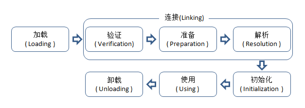

# 类加载机制

<!-- TOC -->

- [类加载机制](#类加载机制)
    - [概述](#概述)
    - [类加载过程](#类加载过程)
    - [加载](#加载)
    - [连接阶段](#连接阶段)
        - [验证](#验证)
        - [准备](#准备)
        - [解析](#解析)
    - [初始化](#初始化)
    - [范例](#范例)
    - [经典例子](#经典例子)
        - [冷知识](#冷知识)
    - [对象初始化顺序](#对象初始化顺序)
    - [为什么创建了一个子类对象会调用其父类的构造方法](#为什么创建了一个子类对象会调用其父类的构造方法)

<!-- /TOC -->

## 概述

闲话不多说，老规矩，先来一段代码吊吊胃口。

```java
public class SSClass {
    static{ System.out.println("SSClass"); }
}   

public class SuperClass extends SSClass {
    static { System.out.println("SuperClass init!"); }
    public static int value = 123;
    public SuperClass() { System.out.println("init SuperClass"); }
}

public class SubClass extends SuperClass {
    static { System.out.println("SubClass init"); }
    static int a;
    public SubClass() { System.out.println("init SubClass"); }
}

public class NotInitialization {
    public static void main(String[] args) {
        System.out.println(SubClass.value);
    }
}
```
运行结果：
```
SSClass
SuperClass init!
123
```
也许有人会疑问：为什么没有输出SubClass init。ok~解释一下：对于静态字段，只有直接定义这个字段的类才会被初始化，因此通过其子类来引用父类中定义的静态字段，只会触发父类的初始化而不会触发子类的初始化。
上面就牵涉到了虚拟机类加载机制。如果有兴趣，可以继续看下去。

## 类加载过程
类从被加载到虚拟机内存中开始，到卸载出内存为止，它的整个生命周期包括7个阶段：
1. 加载（Loading）
1. 验证（Verification）
1. 准备(Preparation)
1. 解析(Resolution)
1. 初始化(Initialization)
1. 使用(Using)
1. 卸载(Unloading)

其中**验证、准备、解析3个部分统称为连接（Linking）**


## 加载
在加载阶段（可以参考`java.lang.ClassLoader`的`loadClass()`方法），虚拟机需要完成以下3件事情：

1. 通过一个类的全限定名来获取定义此类的二进制字节流（并没有指明要从一个Class文件中获取，可以从其他渠道，譬如：网络、动态生成、数据库等）；
1. 将这个字节流所代表的静态存储结构转化为方法区的运行时数据结构；
1. 在内存中生成一个代表这个类的`java.lang.Class`对象，作为方法区这个类的各种数据的访问入口；

**加载阶段** 和**连接阶段（Linking）** 的部分内容（如一部分字节码文件格式验证动作）是交叉进行的，加载阶段尚未完成，连接阶段可能已经开始，但这些夹在加载阶段之中进行的动作，仍然属于连接阶段的内容，这两个阶段的开始时间仍然保持着固定的先后顺序。

## 连接阶段

### 验证

验证是连接阶段的第一步，这一阶段的目的是为了确保Class文件的字节流中包含的信息符合当前虚拟机的要求，并且不会危害虚拟机自身的安全。
验证阶段大致会完成4个阶段的检验动作：

1. 文件格式验证：验证字节流是否符合Class文件格式的规范；例如：是否以魔术`0xCAFEBABE`开头、主次版本号是否在当前虚拟机的处理范围之内、常量池中的常量是否有不被支持的类型。
1. 元数据验证：对字节码描述的信息进行语义分析（注意：对比javac编译阶段的语义分析），以保证其描述的信息符合Java语言规范的要求；例如：这个类是否有父类，除了`java.lang.Object`之外。
1. 字节码验证：通过数据流和控制流分析，确定程序语义是合法的、符合逻辑的。
1. 符号引用验证：确保解析动作能正确执行。

验证阶段是非常重要的，但不是必须的，它对程序运行期没有影响，如果所引用的类经过反复验证，那么可以考虑采用`-Xverifynone`参数来关闭大部分的类验证措施，以缩短虚拟机类加载的时间。

### 准备

准备阶段是正式为类变量分配内存并设置类变量初始值的阶段，这些变量所使用的内存都将在方法区中进行分配。这时候进行内存分配的仅包括类变量（被static修饰的变量），而不包括实例变量，实例变量将会在对象实例化时随着对象一起分配在堆中。其次，这里所说的初始值“通常情况”下是数据类型的零值，假设一个类变量的定义为：
```java
    public static int value=123;
```
那变量`value`在准备阶段过后的初始值为`0`而不是`123`.因为这时候尚未开始执行任何java方法，而把`value`赋值为`123`的`putstatic 指令`是程序被编译后，存放于`类构造器()`方法之中，所以把`value`赋值为`123`的动作将在初始化阶段才会执行。

至于“特殊情况”是指：
```java
public static final int value=123;
```
即当类字段的字段属性是`ConstantValue`时，会在准备阶段初始化为指定的值，所以标注为`final`之后，`value`的值在准备阶段初始化为`123`而非`0`。

### 解析

解析阶段是虚拟机将**常量池内的符号引用** 替换为**直接引用** 的过程。解析动作主要针对类或接口、字段、类方法、接口方法、方法类型、方法句柄和调用点限定符7类符号引用进行。


## 初始化

类初始化阶段是类加载过程的最后一步，到了初始化阶段，才**真正开始执行类中定义的java程序代码** 。在准备阶段，变量已经赋过一次系统要求的初始值，而在初始化阶段，则根据程序员通过程序制定的主观计划去初始化类变量和其他资源，或者说：初始化阶段是执行类构造器`<clinit>()方法`的过程.

>类构造器是编译器收集所有静态语句块和类变量的赋值语句按语句在源码中的顺序合并生成类构造器，对象的构造方法是`<init>()`，类的构造方法是`<clinit>()`，可以在堆栈信息中看到

`<clinit>()方法`是由编译器自动收集类中的所有类变量的赋值动作和静态语句块static{}中的语句合并产生的，编译器收集的顺序是由语句在源文件中出现的顺序所决定的，静态语句块只能访问到定义在静态语句块之前的变量，定义在它之后的变量，在前面的静态语句块可以赋值，但是不能访问。如下：

```java
public class Test {
    static {
        i=0;
        System.out.println(i);//这句编译器会报错：Cannot reference a field before it is defined（非法向前应用）
    }
    static int i=1;
}
```
那么去掉报错的那句，改成下面：
```java
public class Test {
    static { i=0;/* System.out.println(i);*/ }
    static int i=1;

    public static void main(String args[]) {
        System.out.println(i);
    }
}
```
**输出结果是什么呢？**

当然是`1`，在准备阶段我们知道`i=0`，然后类初始化阶段按照顺序执行，首先执行static块中的`i=0`,接着执行static赋值操作`i=1`,最后在main方法中获取i的值为1。

`<clinit>()方法`与`实例构造器<init>()方法`不同，它不需要显示地调用父类构造器，**虚拟机会保证在`子类<clinit>()方法`执行之前，`父类的<clinit>()方法`已经执行完毕，** 回到本文开篇的举例代码中，结果会打印输出： `SSClass`就是这个道理。

由于`父类的<clinit>()方法`先执行，也就意味着父类中定义的静态语句块要优先于子类的变量赋值操作。

`<clinit>()方法`对于类或者接口来说并不是必需的，如果一个类中没有静态语句块，也没有对变量的赋值操作，那么编译器可以不为这个类生成`<clinit>()方法`。


**接口中不能使用静态语句块，但仍然有变量初始化的赋值操作**，因此接口与类一样都会生成`<clinit>()方法`。但接口与类不同的是，执行`接口的<clinit>()方法`不需要先执行`父接口的<clinit>()方法`。只有当父接口中定义的变量使用时，父接口才会初始化。另外，接口的实现类在初始化时也一样不会执行`接口的<clinit>()方法`。

虚拟机会保证一个`类的<clinit>()方法`在多线程环境中**被正确的加锁、同步** ，如果多个线程同时去初始化一个类，那么只会有一个线程去执行这个`类的<clinit>()方法`，**其他线程都需要阻塞等待，直到活动线程执行`<clinit>()方法`完毕** 。如果在一个类的`<clinit>()方法`中有耗时很长的操作，就可能造成多个线程阻塞，在实际应用中这种阻塞往往是隐藏的。

```java
package jvm.classload;

public class DealLoopTest {
    static class DeadLoopClass {
        static {
            if(true) {
                System.out.println(Thread.currentThread()+"init DeadLoopClass");
                while(true){ }
            }
        }
    }

    public static void main(String[] args) {
        Runnable script = new Runnable(){
            public void run() {
                System.out.println(Thread.currentThread()+" start");
                DeadLoopClass dlc = new DeadLoopClass();
                System.out.println(Thread.currentThread()+" run over");
            }
        };

        Thread thread1 = new Thread(script);
        Thread thread2 = new Thread(script);
        thread1.start();
        thread2.start();
    }
}
```
运行结果：（即一条线程在死循环以模拟长时间操作，另一条线程在阻塞等待）
```
Thread[Thread-0,5,main] start
Thread[Thread-1,5,main] start
Thread[Thread-0,5,main]init DeadLoopClass
```

需要注意的是，其他线程虽然会被阻塞，但如果执行`<clinit>()方法`的那条线程退出`<clinit>()方法`后，**其他线程唤醒之后不会再次进入`<clinit>()方法`**。同一个类加载器下，一个类型只会初始化一次。将上面代码中的静态块替换如下：
```java
        static {
            System.out.println(Thread.currentThread() + "init DeadLoopClass");
            try {
                TimeUnit.SECONDS.sleep(10);
            } catch (InterruptedException e) { e.printStackTrace(); }
        }
```
运行结果
```
Thread[Thread-0,5,main] start
Thread[Thread-1,5,main] start
Thread[Thread-1,5,main]init DeadLoopClass (之后sleep 10s)
Thread[Thread-1,5,main] run over
Thread[Thread-0,5,main] run over
```


虚拟机规范严格规定了有且只有5中情况（jdk1.7）必须对类进行“初始化”（而加载、验证、准备自然需要在此之前开始）：

> 对于静态字段，只有直接定义这个字段的类才会被初始化，通过其子类来引用父类中定义的静态字段，只会触发父类的初始化而不会触发子类的初始化。

1. 遇到`new`,`getstatic`,`putstatic`,`invokestatic`这失调字节码指令时，如果类没有进行过初始化，则需要先触发其初始化。生成这4条指令的最常见的Java代码场景是：  
 - 使用`new`关键字实例化对象的时候、
 - 读取或设置一个类的静态字段（被final修饰、已在编译器把结果放入常量池的静态字段除外）的时候
 - 调用一个类的静态方法的时候。
1. 使用java.lang.reflect包的方法对类进行反射调用的时候，如果类没有进行过初始化，则需要先触发其初始化。
1. 当初始化一个类的时候，如果发现其父类还没有进行过初始化，则需要先触发其父类的初始化。
1. 当虚拟机启动时，用户需要指定一个要执行的主类（包含main()方法的那个类），虚拟机会先初始化这个主类。
1. 当使用jdk1.7动态语言支持时，如果一个`java.lang.invoke.MethodHandle`实例最后的解析结果`REF_getstatic`,`REF_putstatic`,`REF_invokeStatic`的方法句柄，并且这个方法句柄所对应的类没有进行初始化，则需要先出触发其初始化。


## 范例

1. **通过数组定义来引用类，不会触发此类的初始化：** （SuperClass类已在本文开篇定义）
```java
public class NotInitialization {
    public static void main(String[] args) {
        SuperClass[] sca = new SuperClass[10]; //运行结果：（无）
    }
}
```

2. **常量在编译阶段会存入调用类的常量池中，本质上并没有直接引用到定义常量的类，因此不会触发定义常量的类的初始化：**

```java
public class ConstClass {
    static {
        System.out.println("ConstClass init!");
    }
    public static  final String HELLOWORLD = "hello world";
}

public class NotInitialization {
    public static void main(String[] args) {
        System.out.println(ConstClass.HELLOWORLD);
        // 运行结果：hello world
    }
}
```

## 经典例子

```java
package jvm.classload;

public class StaticTest {
    public static void main(String[] args) {
        staticFunction();
    }

    static StaticTest st = new StaticTest();

    static { System.out.println("1"); }

    { System.out.println("2"); }

    StaticTest() {
        System.out.println("3");
        System.out.println("a="+a+",b="+b);
    }

    public static void staticFunction(){
        System.out.println("4");
    }

    int a=110;
    static int b =112;
}
```
一般对于这类问题，小伙伴们脑海中肯定浮现出这样的顺序：

> 1. 父类的静态变量赋值
> 2. 自身的静态变量赋值
> 3. 父类成员变量赋值和父类块赋值
> 4. 父类构造函数赋值
> 5. 自身成员变量赋值和自身块赋值
> 6. 自身构造函数赋值

按照这个理论输出是什么呢？答案输出:（这样正确么？）
```
1
4
```
肯定不正确啦，这里不是说上面的规则不正确，而是说不能简单的套用这个规则。**正确答案如下：**

```
2
3
a=110,b=0
1
4
```
这里主要的点之一：**实例初始化不一定要在类初始化结束之后才开始初始化。**

类的生命周期是：加载->验证->准备->解析->初始化->使用->卸载，只有在准备阶段和初始化阶段才会涉及类变量的初始化和赋值，因此只针对这两个阶段进行分析;

类的准备阶段需要做是为类变量分配内存并设置默认值，因此类变量st为null、b为0；（需要注意的是如果类变量是final，编译时javac将会为value生成ConstantValue属性，在准备阶段虚拟机就会根据ConstantValue的设置将变量设置为指定的值，如果这里这么定义：`static final int b=112`,那么在准备阶段b的值就是112，而不再是0了。）

类的初始化阶段需要做是执行类构造器，因此先执行第一条静态变量的赋值语句即`st = new StaticTest ()`，此时会进行对象的初始化，对象的初始化是先初始化成员变量再执行构造方法，因此设置a为110->打印2->执行构造方法(打印3,此时a已经赋值为110，但是b只是设置了默认值0，并未完成赋值动作)，等对象的初始化完成后继续执行之前的类构造器的语句，接下来就不详细说了，按照语句在源码中的顺序执行即可。

### 冷知识
在嵌套初始化时有一个特别的逻辑。特别是内嵌的这个变量恰好是个静态成员，而且是本类的实例。

这会导致一个有趣的现象：**“实例初始化竟然出现在静态初始化之前”** 。 其实并没有提前，你要知道java记录初始化与否的时机。看一个简化的代码，把关键问题解释清楚：

```java
public class Test {
    public static void main(String[] args) {
        func();
    }
    static Test st = new Test();
    static void func(){}
}
```
1. 首先在执行此段代码时，首先由main方法的调用触发静态初始化。
1. 在初始化Test 类的静态部分时，遇到st这个成员。
1. 但凑巧这个变量引用的是本类的实例。
1. 那么问题来了，此时静态初始化过程还没完成就要初始化实例部分了。是这样么？
1. 从人的角度是的。但从java的角度，一旦开始初始化静态部分，无论是否完成，后续都不会再重新触发静态初始化流程了。
1. 因此在实例化st变量时，实际上是把实例初始化嵌入到了静态初始化流程中，并且在楼主的问题中，嵌入到了静态初始化的起始位置。这就导致了实例初始化完全至于静态初始化之前。这也是导致a有值b没值的原因。
1. 最后再考虑到文本顺序，结果就显而易见了。

## 对象初始化顺序
对象的初始化顺序是怎样的呢？看下边儿这个例子：
```java
package com.shigeqiu.practice.utils;

public class ToturialTest {
    public static void main(String[] args) {
        new SecondTest().value();
    }
}

class SecondTest {

    private int a = value();

    int value (){
        System.out.println("普通方法");
        return 10;
    }

    { System.out.println("构造代码块-1"); }

    public SecondTest() { System.out.println("构造方法"); }

    { System.out.println("构造代码块-2"); }

    public void say (){ System.out.println("你好"); }

    static { System.out.println("静态代码块"); }
}
```
执行结果：
```
静态代码块
普通方法
构造代码块-1
构造代码块-2
构造方法
普通方法
```
对象初始化顺序为：**成员变量 -> 构造代码块 -> 构造方法** 。

## 为什么创建了一个子类对象会调用其父类的构造方法

``` java
class A{
    static {
        System.out.println("sa");
    }
    public A() {
        System.out.println("ca");
    }
}

class B extends A{
    static {
        System.out.println("sb");
    }
    public B() {
        System.out.println("cb");
    }
}
public static void main(String[] args)
    {
        new B();
        new A();
    }
```
输出结果
```
sa
sb
ca
cb
ca
```

当一个类继承了某个类时，在子类的构造方法里，super()必须先被调用；如果你没有写，编译器会自动调用super()方法，即调用了父类的构造方法；

这并不是创建了两个对象，其实只有一个子类Sub对象；之所以需要调用父类的构造方法是因为在父类中，可能存在私有属性需要在其构造方法内初始化；

当编译器自动插入父类构造方法的调用后，子类的构造方法类似如下代码：

``` java
public B() {
    super();
    System.out.println("cb");
}
```