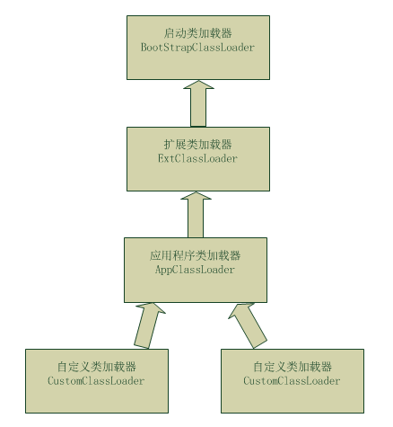

# ClassLoader双亲委派机制

<!-- TOC -->

- [ClassLoader双亲委派机制](#classloader%e5%8f%8c%e4%ba%b2%e5%a7%94%e6%b4%be%e6%9c%ba%e5%88%b6)
  - [什么是双亲委派模型](#%e4%bb%80%e4%b9%88%e6%98%af%e5%8f%8c%e4%ba%b2%e5%a7%94%e6%b4%be%e6%a8%a1%e5%9e%8b)
  - [双亲委派机制为什么安全](#%e5%8f%8c%e4%ba%b2%e5%a7%94%e6%b4%be%e6%9c%ba%e5%88%b6%e4%b8%ba%e4%bb%80%e4%b9%88%e5%ae%89%e5%85%a8)
  - [为什么需要双亲委派模型](#%e4%b8%ba%e4%bb%80%e4%b9%88%e9%9c%80%e8%a6%81%e5%8f%8c%e4%ba%b2%e5%a7%94%e6%b4%be%e6%a8%a1%e5%9e%8b)

<!-- /TOC -->

## 什么是双亲委派模型

“类加载体系”及ClassLoader双亲委派机制。java程序中的 `.java`文件编译完会生成 `.class`文件，而 `.class`文件就是通过被称为类加载器的ClassLoader加载的，而ClassLoder在加载过程中会使用“双亲委派机制”来加载 `.class`文件。



1. BootStrapClassLoader：启动类加载器，该ClassLoader是jvm在启动时创建的，用于加载 $JAVA_HOME/jre/lib下面的类库（或者通过参数-Xbootclasspath指定）。由于引导类加载器涉及到虚拟机本地实现细节，开发者无法直接获取到启动类加载器的引用，所以不能直接通过引用进行操作（由c++编写）。
1. ExtClassLoader：扩展类加载器，该ClassLoader是在sun.misc.Launcher里作为一个内部类ExtClassLoader定义的（即 sun.misc.Launcher$ExtClassLoader），ExtClassLoader会加载 $JAVA_HOME/jre/lib/ext下的类库（或者通过参数-Djava.ext.dirs指定）。
1. AppClassLoader：应用程序类加载器，该ClassLoader同样是在sun.misc.Launcher里作为一个内部类AppClassLoader定义的（即 sun.misc.Launcher$AppClassLoader），AppClassLoader会加载java环境变量CLASSPATH所指定的路径下的类库，而CLASSPATH所指定的路径可以通过System.getProperty("java.class.path")获取；当然，该变量也可以覆盖，可以使用参数-cp，例如：java -cp 路径 （可以指定要执行的class目录）。
1. CustomClassLoader：自定义类加载器，该ClassLoader是指我们自定义的ClassLoader，比如tomcat的StandardClassLoader属于这一类；当然，大部分情况下使用AppClassLoader就足够了。

ClassLoader的loadClass(String name, boolean resolve)源码：

``` java
protected synchronized Class<?> loadClass(String name, boolean resolve) throws ClassNotFoundException {
        // First, check if the class has already been loaded
        Class c = findLoadedClass(name);
        if (c == null) {
            try {
                if (parent != null) {
                    c = parent.loadClass(name, false);
                } else {
                    c = findBootstrapClassOrNull(name);
                }
            } catch (ClassNotFoundException e) {
                // ClassNotFoundException thrown if class not found
                // from the non-null parent class loader
            }
            if (c == null) {
                // If still not found, then invoke findClass in order
                // to find the class.
                c = findClass(name);
            }
        }
        if (resolve) {
            resolveClass(c);
        }
        return c;
    }
```

代码很明朗：首先找缓存（findLoadedClass），没有的话就判断有没有parent，有的话就用parent来递归的loadClass，然而ExtClassLoader并没有设置parent，则会通过findBootstrapClassOrNull来加载class，而findBootstrapClassOrNull则会通过JNI方法 `private native Class findBootstrapClass(String name)` 来使用BootStrapClassLoader来加载class。

然后如果parent未找到class，则会调用findClass来加载class，findClass是一个protected的空方法，可以覆盖它以便自定义class加载过程。

另外，**虽然ClassLoader加载类是使用loadClass方法，但是鼓励用 ClassLoader 的子类重写 findClass(String)，而不是重写loadClass，这样就不会覆盖了类加载默认的双亲委派机制。**

## 双亲委派机制为什么安全

举个例子，ClassLoader加载的class文件来源很多，比如编译器编译生成的class、或者网络下载的字节码。而一些来源的class文件是不可靠的，比如我可以自定义一个java.lang.Integer类来覆盖jdk中默认的Integer类，例如下面这样：

``` java
package java.lang;

public class Integer {
    public Integer(int value) {
        System.exit(0);
    }
}
```

初始化这个Integer的构造器是会退出JVM，破坏应用程序的正常进行，如果使用双亲委派机制的话该Integer类永远不会被调用，因为委托BootStrapClassLoader加载后会加载JDK中的Integer类而不会加载自定义的这个，可以看下下面这测试个用例：
``` java
public static void main(String... args) {
        Integer i = new Integer(1);
        System.err.println(i);
    }
```
执行时JVM并未在new Integer(1)时退出，说明未使用自定义的Integer，于是就保证了安全性。

## 为什么需要双亲委派模型

为什么需要双亲委派模型呢？假设没有双亲委派模型，试想一个场景：

黑客自定义一个java.lang.String类，该String类具有系统的String类一样的功能，只是在某个函数稍作修改。比如equals函数，这个函数经常使用，如果在这这个函数中，黑客加入一些“病毒代码”。并且通过自定义类加载器加入到JVM中。此时，如果没有双亲委派模型，那么JVM就可能误以为黑客自定义的java.lang.String类是系统的String类，导致“病毒代码”被执行。

而有了双亲委派模型，黑客自定义的java.lang.String类永远都不会被加载进内存。因为首先是最顶端的类加载器加载系统的java.lang.String类，最终自定义的类加载器无法加载java.lang.String类。

或许你会想，我在自定义的类加载器里面强制加载自定义的java.lang.String类，不去通过调用父加载器不就好了吗?确实，这样是可行。但是，在JVM中，判断一个对象是否是某个类型时，如果该对象的实际类型与待比较的类型的类加载器不同，那么会返回false。

举个简单例子：

ClassLoader1、ClassLoader2都加载java.lang.String类，对应Class1、Class2对象。那么Class1对象不属于ClassLoad2对象加载的java.lang.String类型。