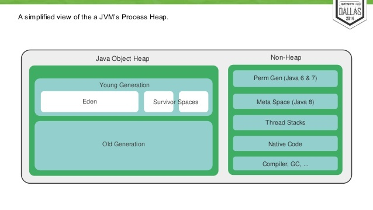
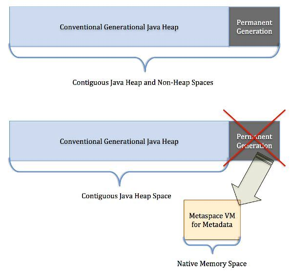

# 聊聊jvm的PermGen与Metaspace

<!-- TOC -->

- [聊聊jvm的PermGen与Metaspace](#%e8%81%8a%e8%81%8ajvm%e7%9a%84permgen%e4%b8%8emetaspace)
  - [java memory结构](#java-memory%e7%bb%93%e6%9e%84)
    - [分代概念](#%e5%88%86%e4%bb%a3%e6%a6%82%e5%bf%b5)
    - [memory划分](#memory%e5%88%92%e5%88%86)
  - [PermGen与Metaspace](#permgen%e4%b8%8emetaspace)
    - [字符串常量池的变化](#%e5%ad%97%e7%ac%a6%e4%b8%b2%e5%b8%b8%e9%87%8f%e6%b1%a0%e7%9a%84%e5%8f%98%e5%8c%96)
    - [方法区的变化](#%e6%96%b9%e6%b3%95%e5%8c%ba%e7%9a%84%e5%8f%98%e5%8c%96)
  - [Metaspace相关参数](#metaspace%e7%9b%b8%e5%85%b3%e5%8f%82%e6%95%b0)
  - [小结](#%e5%b0%8f%e7%bb%93)

<!-- /TOC -->

## java memory结构

### 分代概念

对于垃圾收集算法来说，分代回收是高级算法之一。对象按照生成时间进行分代，刚刚生成不久的年轻对象划为新生代（Young gen-eration），而存活了较长时间的对象划为老生代（Old generation）。根据具体实现方式的不同，可能还会划分更多的代。比如有的把永久代也算做一个代。

### memory划分

java memory主要分heap memory 和 non-heap memory，其计算公式如下：

``` sh
Max memory = [-Xmx] + [-XX:MaxPermSize] + number_of_threads * [-Xss]
```



- heap结构

按分代，分`young-eden`,`young-survivor`,`old`，用`-Xmn`,`-Xms`,`-Xmx`来指定

- non-heap结构

包括`metaspace`,`thread stacks`,`compiled native code`,`memory allocated by native code`

`-XX:PermSize`或`-XX:MetaspceSize`,`-Xss`或`-XX:ThreadStackSize`

## PermGen与Metaspace

### 字符串常量池的变化

> 在java7的时候将字符串常量池则移到java heap

所有的被intern的String被存储在PermGen区.PermGen区使用-XX:MaxPermSize=N来设置最大大小，但是由于应用程序string.intern通常是不可预测和不可控的，因此不好设置这个大小。设置不好的话，常常会引起

```
java.lang.OutOfMemoryError: PermGen space
```

> java7，8的字符串常量池在堆中实现

字符串常量池被限制在整个应用的堆内存中，在运行时调用String.intern()增加字符串常量不会使永久代OOM了。

### 方法区的变化

- java8的时候去除PermGen，将其中的方法区移到non-heap中的Metaspace

> move name and fields of the class, methods of a class with the bytecode
of the methods, constant pool, JIT optimizations etc to metaspace

- Metaspace属于non-heap

Metaspace与PermGen之间最大的区别在于：Metaspace并不在虚拟机中，而是使用本地内存。



如果没有使用 `-XX:MaxMetaspaceSize` 来设置类的元数据的大小，其最大可利用空间是整个系统内存的可用空间。JVM也可以增加本地内存空间来满足类元数据信息的存储。
但是如果没有设置最大值，则可能存在bug导致Metaspace的空间在不停的扩展，会导致机器的内存不足；进而可能出现swap内存被耗尽；最终导致进程直接被系统直接kill掉。

- OOM异常

如果类元数据的空间占用达到MaxMetaspaceSize设置的值，将会触发对象和类加载器的垃圾回收。

```
java.lang.OutOfMemoryError: Metaspace space
```
JVM从Metaspace在捕获一个一个内存分配失败后抛出。


## Metaspace相关参数

- `-XX:MetaspaceSize`，初始空间大小，达到该值就会触发垃圾收集进行类型卸载，同时GC会对该值进行调整：如果释放了大量的空间，就适当降低该值；如果释放了很少的空间，那么在不超过MaxMetaspaceSize时，适当提高该值。
- `-XX:MaxMetaspaceSize`，最大空间，默认是没有限制的。
- `-XX:MinMetaspaceFreeRatio`，在GC之后，最小的Metaspace剩余空间容量的百分比，减少为分配空间所导致的垃圾收集
- `-XX:MaxMetaspaceFreeRatio`，在GC之后，最大的Metaspace剩余空间容量的百分比，减少为释放空间所导致的垃圾收集

## 小结

将常量池从PermGen剥离到heap中，将元数据从PermGen剥离到元数据区，去除PermGen的好处如下：

- 将字符串常量池从PermGen分离出来，与类元数据分开，提升类元数据的独立性
- 将元数据从PermGen剥离出来到Metaspace，可以提升对元数据的管理同时提升GC效率。

在PermGen中元数据可能会随着每一次Full GC发生而进行移动。HotSpot虚拟机的每种类型的垃圾回收器都需要特殊处理PermGen中的元数据，分离出来以后可以简化Full GC以及对以后的并发隔离类元数据等方面进行优化。

- 为后续将HotSpot与JRockit合二为一做准备。

PermGen是HotSpot的实现特有的，JRockit并没有PermGen一说。

> 来自 https://segmentfault.com/a/1190000012577387