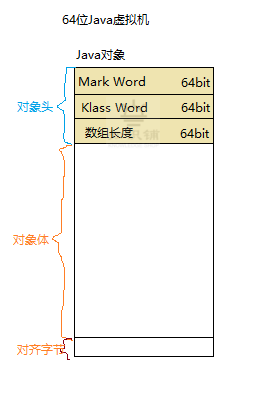
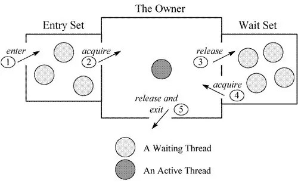

# wait和notify

<!-- TOC -->

- [wait和notify](#wait%e5%92%8cnotify)
  - [总结](#%e6%80%bb%e7%bb%93)
  - [notify 和 notifyAll的区别](#notify-%e5%92%8c-notifyall%e7%9a%84%e5%8c%ba%e5%88%ab)
  - [Monitor](#monitor)
  - [wait没有获取锁的情况](#wait%e6%b2%a1%e6%9c%89%e8%8e%b7%e5%8f%96%e9%94%81%e7%9a%84%e6%83%85%e5%86%b5)
  - [notify没有获取锁的情况](#notify%e6%b2%a1%e6%9c%89%e8%8e%b7%e5%8f%96%e9%94%81%e7%9a%84%e6%83%85%e5%86%b5)

<!-- /TOC -->

## 总结

1. **`wait()`、`notify/notifyAll()` 方法是Object的本地final方法，无法被重写。**
1. `wait()`使当前线程阻塞，前提是必须先获得锁，一般配合synchronized 关键字使用，一般在synchronized 同步代码块里使用 `wait()`、`notify/notifyAll()` 方法。
1. wait() 需要被try catch包围，中断也可以使wait等待的线程唤醒。
1. notify 和wait 的顺序不能错，如果A线程先执行notify方法，B线程在执行wait方法，那么B线程是无法被唤醒的。
1. 由于 wait()、notify/notifyAll() 在synchronized 代码块执行，说明当前线程一定是获取了锁的。

当线程执行wait()方法时候，会释放当前的锁，然后让出CPU，进入等待状态。只有当 notify/notifyAll() 被执行时候，才会唤醒一个或多个正处于等待状态的线程，然后继续往下执行，直到执行完synchronized 代码块的代码或是中途遇到wait() ，再次释放锁。

也就是说，notify/notifyAll() 的执行只是唤醒沉睡的线程，而不会立即释放锁，锁的释放要看代码块的具体执行情况。所以在编程中，尽量在使用了notify/notifyAll() 后立即退出临界区，以唤醒其他线程 


## notify 和 notifyAll的区别

notify方法只唤醒一个等待（对象的）线程并使该线程开始执行。所以如果有多个线程等待一个对象，这个方法只会唤醒其中一个线程，选择哪个线程取决于操作系统对多线程管理的实现。notifyAll 会唤醒所有等待(对象的)线程，尽管哪一个线程将会第一个处理取决于操作系统的实现。如果当前情况下有多个线程需要被唤醒，推荐使用notifyAll 方法。比如在生产者-消费者里面的使用，每次都需要唤醒所有的消费者或是生产者，以判断程序是否可以继续往下执行。

## Monitor

使用 monitor 机制的目的主要是为了互斥进入临界区，为了做到能够阻塞无法进入临界区的 进程/线程，还需要一个 monitor object 来协助，这个 monitor object 内部会有相应的数据结构，例如列表，来保存被阻塞的线程；同时由于 monitor 机制本质上是基于 mutex 这种基本原语的，所以 monitor object 还必须维护一个基于 mutex 的锁。



Java 对象存储在内存中，分别分为三个部分，即对象头、实例数据和对齐填充，而在其对象头中，保存了锁标识；同时，java.lang.Object 类定义了 wait()，notify()，notifyAll() 方法，这些方法的具体实现，依赖于一个叫 ObjectMonitor 模式的实现，这是 JVM 内部基于 C++ 实现的一套机制。




Java平台中，每个对象都有一个唯一与之对应的内部锁（Monitor）。Java虚拟机会为每个对象维护两个“队列”（姑且称之为“队列”，尽管它不一定符合数据结构上队列的“先进先出”原则）：一个叫Entry Set（入口集），另外一个叫Wait Set（等待集）。对于任意的对象objectX，objectX的Entry Set用于存储等待获取objectX对应的内部锁的所有线程。objectX的Wait Set用于存储执行了objectX.wait()/wait(long)的线程。

设objectX是任意一个对象，monitorX是这个对象对应的内部锁，假设有线程A、B、C同时申请monitorX，那么由于任意一个时刻只有一个线程能够获得（占用/持有）这个锁，因此除了胜出（即获得了锁）的线程（这里假设是B）外，其他线程（这里就是A和C）都会被暂停（线程的生命周期状态会被调整为BLOCKED）。这些因申请锁而落选的线程就会被存入objectX对应的Entry Set（以下记为entrySetX）之中。当monitorX被其持有线程（这里就是B）释放时，entrySetX中的一个任意（**注意是“任意”，而不一定是Entry Set中等待时间最长或者最短的**）线程会被唤醒（即线程的生命周期状态变更为RUNNABLE）。这个被唤醒的线程会与其他活跃线程（即不处于Entry Set之中，且线程的生命周期状态为RUNNABLE的线程）再次抢占monitorX。这时，被唤醒的线程如果成功申请到monitorX，那么该线程就从entrySetX中移除。否则，被唤醒的线程仍然会停留在entrySetX，并再次被暂停，以等待下次申请锁的机会。

 

如果有个线程执行了objectX.wait()，那么该线程就会被暂停（线程的生命周期状态会被调整为WAITTING）并被存入objectX的Wait Set（以下记为waitSetX）之中。此时，该线程就被称为objectX的等待线程。当其他线程执行了objectX.notify()/notifyAll()时，waitSetX中的一个（或者多个，取决于被调用的是notify还是notifyAll方法）任意（**注意是“任意”，而不一定是Entry Set中等待时间最长或者最短的**）等待线程会被唤醒（线程的生命周期状态变更为RUNNABLE）。这些被唤醒的线程会与entrySetX中被唤醒的线程以及其他（可能的）活跃线程共同参与抢夺monitorX。如果其中一个被唤醒的等待线程成功申请到锁，那么该线程就会从waitSetX中移除。否则，这些被唤醒的线程仍然停留在waitSetX中，并再次被暂停，以等待下次申请锁的机会。

我理解调用对象的 notifyAll方法后，waitSet 上的线程都会加入到 entrySet 中的吧？在一个持有锁的线程释放锁后，应该只有 entrySet 队列的线程可能获取锁，那这个通知是 park 来实现的吗？是否有保证获取锁公平性的相关设置?

1、从Java虚拟机性能的角度来说，Java虚拟机没有必要在notifyAll调用之后“将Wait Set中的线程移入Entry Set”。首先，从一个“队列”移动到另外一个“队列”是有开销的，其次，虽然notifyAll调用后Wait Set中的多个线程会被唤醒，但是这些被唤醒的线程极端情况下可能没有任何一个能够获得锁（比如被其他活跃线程抢先下手了）或者即便可以获得锁也可能不能继续运行（比如这些等待线程所需的等待条件又再次不成立）。那么这个时候，这些等待线程仍然需要老老实实在wait set中待着。因此，如果notifyAll调用之后就将等待线程移出wait set会导致浪费（白白地进出“队列”）。这点可以参考显式锁的实现：
`java.util.concurrent.locks.AbstractQueuedSynchronizer.acquireQueued(Node, int)`

``` java
/**
  * Acquires in exclusive uninterruptible mode for thread already in
  * queue. Used by condition wait methods as well as acquire.
  *
  * @param node the node
  * @param arg the acquire argument
  * @return {@code true} if interrupted while waiting
  */
final boolean acquireQueued(final Node node, int arg) {
    boolean failed = true;
    try {
        boolean interrupted = false;
        for (;;) {
            final Node p = node.predecessor();
            if (p == head && tryAcquire(arg)) {
                setHead(node);
                p.next = null; // help GC
                failed = false;
                return interrupted;
            }
            if (shouldParkAfterFailedAcquire(p, node) &&
                parkAndCheckInterrupt())
                interrupted = true;
        }
    } finally {
        if (failed)
            cancelAcquire(node);
    }
}
```

从上面的代码可以看出，（使用显式锁时）被唤醒的线程获得锁（tryAcquire调用返回true）之后才被从wait set中移出（setHead调用）。

2、内部锁仅仅支持非公平锁调度。显式锁既支持公平锁又支持非公平锁。

LockSupport.park/upark是在jdk1.5开始引入的，显式锁的在实现线程的暂停和唤醒的时候会用到这个两个方法。而内部锁是在jdk1.5之前就已经存在的。

## wait没有获取锁的情况

``` java
public class BB {
    private void bb() {
        try {
            this.wait();
        } catch (InterruptedException e) {
            e.printStackTrace();
        }
        System.out.println("bbbb");
    }

    public static void main(String[] args) {
        new BB().bb();
    }
}
```
异常：非法监视器状态异常
```
Exception in thread "main" java.lang.IllegalMonitorStateException
	at java.lang.Object.wait(Native Method)
	at java.lang.Object.wait(Object.java:502)
	at com.shigeqiu.demo.BB.bb(BB.java:10)
	at com.shigeqiu.demo.BB.main(BB.java:19)
```

## notify没有获取锁的情况

``` java
public class BB {
    private void bb() {
        this.notify();
        System.out.println("bbbb");
    }

    public static void main(String[] args) {
        new BB().bb();
    }
}
```
异常：非法监视器状态异常
```
Exception in thread "main" java.lang.IllegalMonitorStateException
	at java.lang.Object.notify(Native Method)
	at com.shigeqiu.demo.BB.bb(BB.java:9)
	at com.shigeqiu.demo.BB.main(BB.java:14)
```