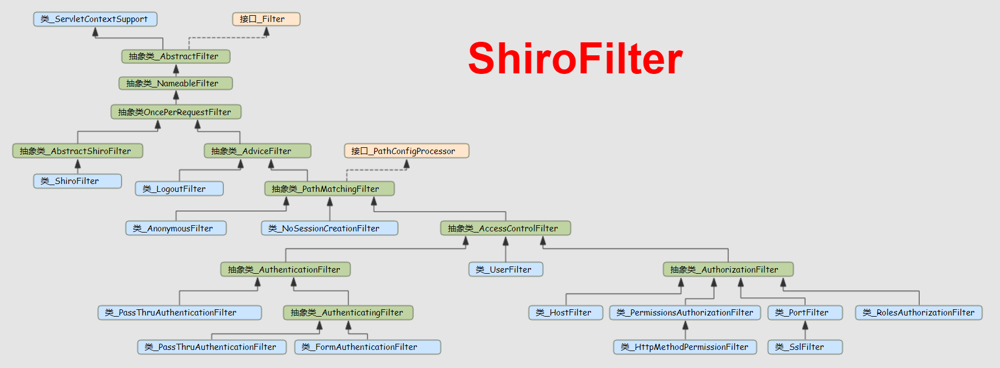

# Filter大动脉

<!-- TOC -->

- [Filter大动脉](#filter大动脉)
    - [ShiroFilter初始化](#shirofilter初始化)
    - [doFilter方法](#dofilter方法)

<!-- /TOC -->



## ShiroFilter初始化

**第一步** ，先走`AbstractFilter`的init方法；
```
public final void init(FilterConfig filterConfig) throws ServletException {
    setFilterConfig(filterConfig);
    try {
        onFilterConfigSet();
    } catch (Exception e) {
        if (e instanceof ServletException) {
            throw (ServletException) e;
        } else {
            if (log.isErrorEnabled()) {
                log.error("Unable to start Filter: [" + e.getMessage() + "].", e);
            }
            throw new ServletException(e);
        }
    }
}
```
其中`setFilterConfig`会将FilterConfig对象set到自身的私有属性，并将ServletContext对象set到ServletContextSupport对象中。然后再执行`onFilterConfigSet`方法，此方法由子类继承重写。

**第二步** ，执行`AbstractShiroFilter`对象的`onFilterConfigSet`方法

```
private static final String STATIC_INIT_PARAM_NAME = "staticSecurityManagerEnabled";

protected final void onFilterConfigSet() throws Exception {
    //added in 1.2 for SHIRO-287:
    applyStaticSecurityManagerEnabledConfig();  //设置isStaticSecurityManagerEnabled，意义不大，很少使用，把你的好奇心最好抹掉
    init();
    ensureSecurityManager();  // 再次确保SecurityManager不为空
    //added in 1.2 for SHIRO-287:
    if (isStaticSecurityManagerEnabled()) {
        SecurityUtils.setSecurityManager(getSecurityManager());
    }
}
```
这个方法没有做什么有意义的事情，只是再次确保了一下manager，然后设置了一个静态内存的东西，暂时不知道是什么。

主要做到了以下两点
- 将SecurityManager对象set到SecurityUtils中，为以后使用方便


## doFilter方法

1. **第一步** `OncePerRequestFilter`主要实现了过滤器的`doFilter`方法

    ```
    
    public final void doFilter(ServletRequest request, ServletResponse response, FilterChain filterChain)
            throws ServletException, IOException {
        String alreadyFilteredAttributeName = getAlreadyFilteredAttributeName();
        if ( request.getAttribute(alreadyFilteredAttributeName) != null ) {
            log.trace("Filter '{}' already executed.  Proceeding without invoking this filter.", getName());
            filterChain.doFilter(request, response);
        } else //noinspection deprecation
            if (/* added in 1.2: */ !isEnabled(request, response) ||
                /* retain backwards compatibility: */ shouldNotFilter(request) ) {
            log.debug("Filter '{}' is not enabled for the current request.  Proceeding without invoking this filter.",
                    getName());
            filterChain.doFilter(request, response);
        } else {
            // Do invoke this filter...
            log.trace("Filter '{}' not yet executed.  Executing now.", getName());
            request.setAttribute(alreadyFilteredAttributeName, Boolean.TRUE);
    
            try {
                doFilterInternal(request, response, filterChain);
            } finally {
                // Once the request has finished, we're done and we don't
                // need to mark as 'already filtered' any more.
                request.removeAttribute(alreadyFilteredAttributeName);
            }
        }
    }
    ```
    默认回向request中插入一个属性`"shiroFilter.FILTERED"=true`（最后再移除），然后走`doFilterInternal`方法。  该方法是此类中的一个抽象方法。
    > 另外，该类中会有一个`enabled`属性，来判定是否启用该shiroFilter过滤器，如果不启用则`filterChain.doFilter(request, response);`处理下一个过滤器，不过需要注意的是我们通常做权限还是只需要配一个shiroFilter就够用了，因此该属性不用太在意。


2. **第二步** `AbstractShiroFilter`  ,该类中的`createSubject`方法，的创建过程是，交给Builder去创建两个对象，分别是SubjectContext,SecurityManager，将request和response分别插入到SubjectContext中，最后由SecurityManager通过调用createSubject()方法，并以SubjectContext为参数，创建subject对象。该方法主要在`DefaultSecurityManager`类中实现逻辑，然后再委托给SubjectFactory对象去创建Subject对象，因此可见SubjectFactory才是真正创建Subject对象的地方，然后在这里通过`new WebDelegatingSubject()`或者`new DelegatingSubject()`的两个方式去创建Subject对象，最后再返回。
    ```
    protected void doFilterInternal(ServletRequest servletRequest, ServletResponse servletResponse, final FilterChain chain)
                throws ServletException, IOException {
    
        Throwable t = null;
    
        try {
            final ServletRequest request = prepareServletRequest(servletRequest, servletResponse, chain);
            final ServletResponse response = prepareServletResponse(request, servletResponse, chain);
    
            final Subject subject = createSubject(request, response);
    
            //noinspection unchecked
            subject.execute(new Callable() {
                public Object call() throws Exception {
                    updateSessionLastAccessTime(request, response);
                    executeChain(request, response, chain);
                    return null;
                }
            });
        } catch (ExecutionException ex) {
            t = ex.getCause();
        } catch (Throwable throwable) {
            t = throwable;
        }
    
    }
    ```


