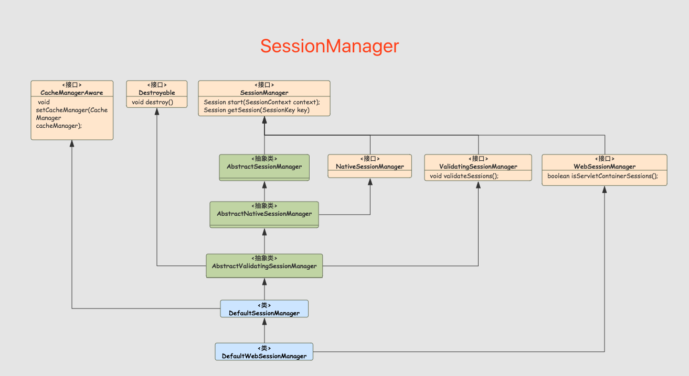

# SessionManager

<!-- TOC -->

- [SessionManager](#sessionmanager)
    - [AbstractSessionManager](#abstractsessionmanager)
    - [AbstractNativeSessionManager](#abstractnativesessionmanager)
- [Session 何时被创建的](#session-何时被创建的)
    - [登录完以后首次创建](#登录完以后首次创建)

<!-- /TOC -->



## AbstractSessionManager
主要定义了一些常量，和一个全局的session超时属性，并提供了get/set方法。  
如：`private long globalSessionTimeout = DEFAULT_GLOBAL_SESSION_TIMEOUT;`

## AbstractNativeSessionManager


# Session 何时被创建的

## 登录完以后首次创建

1. 在`DefaultSecurityManager`中登录完以后创建，主要创建逻辑在`sava(subject);`中
    ```
     public Subject createSubject(SubjectContext subjectContext) {
        //create a copy so we don't modify the argument's backing map:
        SubjectContext context = copy(subjectContext);

        //ensure that the context has a SecurityManager instance, and if not, add one:
        context = ensureSecurityManager(context);

        //Resolve an associated Session (usually based on a referenced session ID), and place it in the context before
        //sending to the SubjectFactory.  The SubjectFactory should not need to know how to acquire sessions as the
        //process is often environment specific - better to shield the SF from these details:
        context = resolveSession(context);

        //Similarly, the SubjectFactory should not require any concept of RememberMe - translate that here first
        //if possible before handing off to the SubjectFactory:
        context = resolvePrincipals(context);

        Subject subject = doCreateSubject(context);

        //save this subject for future reference if necessary:
        //(this is needed here in case rememberMe principals were resolved and they need to be stored in the
        //session, so we don't constantly rehydrate the rememberMe PrincipalCollection on every operation).
        //Added in 1.2:
        save(subject);

        return subject;
    }
    ```
2. save方法主要调用subjectDAO的逻辑
    ```
    protected void save(Subject subject) {
        this.subjectDAO.save(subject);
    }
    ```
3. 在subjectDAO中会通过`Subject.getSession(true);`创建
4. Subject.getSession(Boolean)的逻辑，主要是获取Session。
    - 如果Subject中有Session，则会返回。
    - 如果是true并且Subject中没有，则会创建一个新的Session。
    - 如果是false并且Subject中没有，则会返回空。
    
    **代码如下**:  
        可以看到，它在里边调用了SecurityManager的start的方法来创建新的Session。
    ```
    public Session getSession(boolean create) {
        if (log.isTraceEnabled()) {
            log.trace("attempting to get session; create = " + create +
                    "; session is null = " + (this.session == null) +
                    "; session has id = " + (this.session != null && session.getId() != null));
        }

        if (this.session == null && create) {

            //added in 1.2:
            if (!isSessionCreationEnabled()) {
                String msg = "Session creation has been disabled for the current subject.  This exception indicates " +
                        "that there is either a programming error (using a session when it should never be " +
                        "used) or that Shiro's configuration needs to be adjusted to allow Sessions to be created " +
                        "for the current Subject.  See the " + DisabledSessionException.class.getName() + " JavaDoc " +
                        "for more.";
                throw new DisabledSessionException(msg);
            }

            log.trace("Starting session for host {}", getHost());
            SessionContext sessionContext = createSessionContext();
            Session session = this.securityManager.start(sessionContext);
            this.session = decorate(session);
        }
        return this.session;
    }
    ```
5. SessionKey中的id是通过uuid来实现的，此逻辑是在SessionDAO中的。
6. Session的创建逻辑已结束。
7. 后续通过`resolveSession`的方法去判断session即可，此逻辑在`DefaultSecurityManager`和`SubjectContext`中都有。