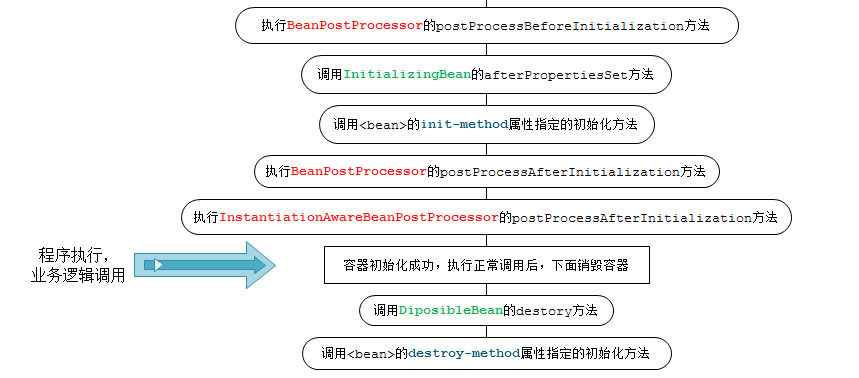
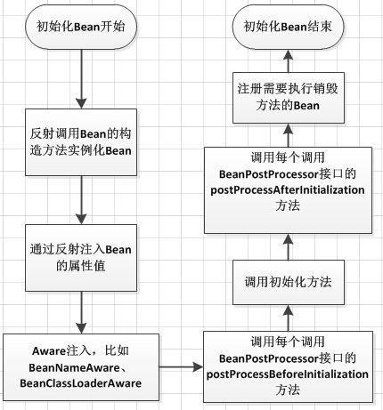

# Spring Bean生命周期

Bean的生命周期：

1. Bean的建立， 由BeanFactory读取Bean定义文件，并生成各个实例
1. Setter注入，执行Bean的属性依赖注入
1. BeanNameAware的setBeanName(), 如果实现该接口，则执行其setBeanName方法
1. BeanFactoryAware的setBeanFactory()，如果实现该接口，则执行其setBeanFactory方法
1. BeanPostProcessor的processBeforeInitialization()，如果有关联的processor，则在Bean初始化之前都会执行这个实例的processBeforeInitialization()方法
1. InitializingBean的afterPropertiesSet()，如果实现了该接口，则执行其afterPropertiesSet()方法
1. Bean定义文件中定义init-method
1. BeanPostProcessors的processAfterInitialization()，如果有关联的processor，则在Bean初始化之前都会执行这个实例的processAfterInitialization()方法
1. DisposableBean的destroy()，在容器关闭时，如果Bean类实现了该接口，则执行它的destroy()方法
1. Bean定义文件中定义destroy-method，在容器关闭时，可以在Bean定义文件中使用“destory-method”定义的方法

如果使用`ApplicationContext`来维护一个Bean的生命周期，则基本上与上边的流程相同，只不过在执行`BeanNameAware`的`setBeanName()`后，若有Bean类实现了`org.springframework.context.ApplicationContextAware`接口，则执行其`setApplicationContext()`方法，然后再进行`BeanPostProcessors`的`processBeforeInitialization()`
实际上，`ApplicationContext` 除了像`BeanFactory`那样维护容器外，还提供了更加丰富的框架功能，如Bean的消息，事件处理机制等。