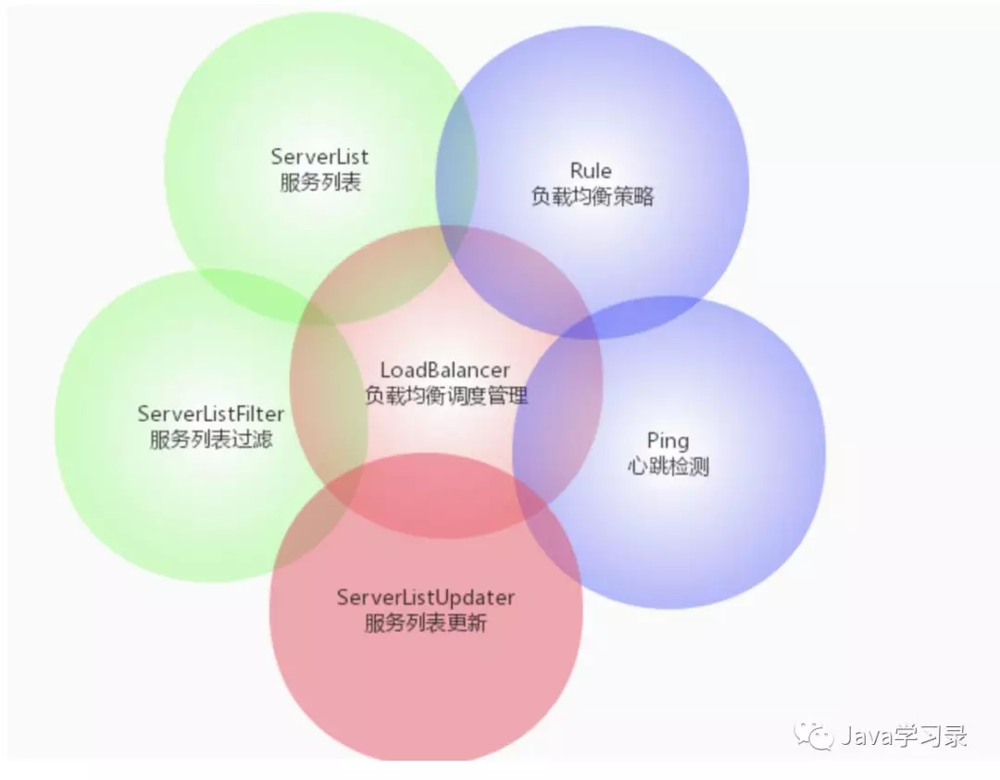

# Spring Cloud Ribbon

<!-- TOC -->

- [Spring Cloud Ribbon](#spring-cloud-ribbon)
  - [配置](#%e9%85%8d%e7%bd%ae)
  - [Ribbon饥饿加载](#ribbon%e9%a5%a5%e9%a5%bf%e5%8a%a0%e8%bd%bd)
  - [负载均衡策略](#%e8%b4%9f%e8%bd%bd%e5%9d%87%e8%a1%a1%e7%ad%96%e7%95%a5)

<!-- /TOC -->

Spring Cloud Ribbon 是一个客户端的负载均衡器。客户端会向 Eureka Server 读取注册到服务器的可用服务信息列表，然后根据设定的负载均衡策略（没有设置即用默认的），抉择出向哪台服务器发送请求。




## 配置

Spring Cloud Ribbon 支持多种配置方式，最常用的是以 application.yml 等配置文件和编程式的方式进行配置。我们先来熟悉一下配置的格式。`<clientName>.<nameSpace>.<propertyName>=<value>` 的格式来描述参数的，其中 `clientName` 代表了基于 Ribbon 客户端的名称，而 `nameSpace` 则是类似配置组的概念，代表了一组配置的参数。


## Ribbon饥饿加载

默认情况下Ribbon是懒加载的。当服务起动好之后，第一次请求是非常慢的，第二次之后就快很多。

解决方式：开启饥饿加载

``` yml
ribbon:
 eager-load:
  enabled: true #开启饥饿加载
  clients: server-1,server-2,server-3 #为哪些服务的名称开启饥饿加载,多个用逗号分隔
```

## 负载均衡策略


**1. `com.netflix.loadbalancer.RandomRule`**

随机选择一个Server

**2. `com.netflix.loadbalancer.RetryRule`**

对选定的负责均衡策略机上重试机制，在一个配置时间段内当选择Server不成功，则一直尝试使用subRule的方式选择一个可用的Server。

``` java
//内部默认维护一个线性轮训的Rule
IRule subRule = new RoundRobinRule();
```

**3. `com.netflix.loadbalancer.RoundRobinRule`**


轮询选择，轮询index，选择index对应位置Server，以线性轮询的方式，就是维护一个计数器，从提供服务的实例中按顺序选取，第一次选第一个，第二次选第二个，以此类推，到最后一个以后再从头来过。

**4. `com.netflix.loadbalancer.WeightedResponseTimeRule`**

对 `RoundRobinRule` 的扩展，响应速度越快的实例选择权重越大，越容易被选择；`ResponseTimeWeightedRule` 已废除,作用同`WeightedResponseTimeRule` 。

**5. `com.netflix.loadbalancer.AvailabilityFilteringRule`**

先过滤掉故障实例，再选择并发较小的实例，过滤掉一直连接失败的被标记为circuit tripped（电路跳闸）的后端Service，并过滤掉那些高并发的后端Server或者使用一个AvailabilityPredicate来包含过滤Server的逻辑，其实就是检查status的记录的各个Server的运行状态

**6. `com.netflix.loadbalancer.ZoneAvoidanceRule`**

**（默认是这个）** 负责判断Server所Zone的性能和Server的可用性选择Server，在没有Zone的环境下，类似于轮询（RoundRobinRule）

**7. `com.netflix.loadbalancer.BestAvailableRule`**

最空闲连接策略，选择并发较小的实例，选择一个最小的并发请求的Server，逐个考察Server，如果Server被tripped了，则跳过